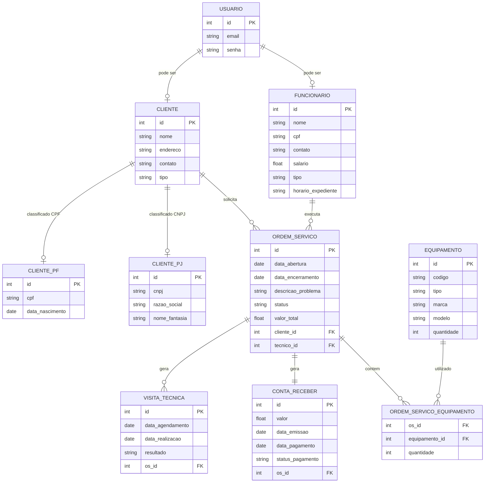

# Documento de Visão

Documento construído a partido do **Modelo BSI - Doc 001 - Documento de Visão** que pode ser encontrado no
link: https://docs.google.com/document/d/1DPBcyGHgflmz5RDsZQ2X8KVBPoEF5PdAz9BBNFyLa6A/edit?usp=sharing

## Descrição do Projeto

Título: Sistema de Gestão de Assistência Técnica
Descrição: O Sistema de Gestão de Assistência Técnica é uma aplicação web que tem como objetivo gerenciar clientes, ordens de serviço, equipamentos e visitas técnicas de forma organizada e eficiente. Ele permite cadastrar e acompanhar ordens de serviço, e gerar relatórios para facilitar o acompanhamento das atividades. O sistema oferece diferentes perfis de usuários, possa acessar as funcionalidades de acordo com suas permissões.

## Equipe e Definição de Papéis

Membro     |     Papel   |   E-mail   |
---------  | ----------- | ---------- |
Jadson    | --  | -- |
Mariana     | Analista, Desenvolvedor | araujodemedeirosmariana@gmail.com |

### Matriz de Competências

Membro     |     Competências   |
---------  | ----------- |
Jadson    | --  |
Mariana     | -- | 

## Perfis dos Usuários

O sistema poderá ser utilizado por diversos usuários. Temos os seguintes perfis/atores:

Perfil                                 | Descrição   |
---------                              | ----------- |
Cliente | Este usuário pode verificar suas ordens de serviço, consultar contas a receber e realizar pagamentos online de serviços concluídos.
Administrativo | Este usuário é responsável pela gestão do sistema, cadastro de informações, controle financeiro e registro de pagamentos recebidos fora do sistema.
Técnico | Este usuário é responsável pela execução dos serviços, atualização das ordens de serviço e registro de peças utilizadas.

## Lista de Requisitos Funcionais

### Entidade Autenticar - RF01 - Autenticar
Ato dos usuários (clientes e funcionários) realizem login utilizando credenciais válidas.

Requisito                     | Descrição   | Ator |
---------                     | ----------- | ---------- |
RF01.1 - Realizar Login       | Permitir que usuários (clientes e funcionários) realizem login utilizando credenciais válidas. | Cliente, Funcionário |
RF01.2 - Realizar Logout      | Açao que permitir ao usuário encerre sua sessão com segurança. | Cliente, Funcionário |
RF01.3 - Recuperar Senha      | Açao que permitir ao usuário recupere sua senha por meio de e-mail ou SMS. | Cliente, Funcionário |

---

### Entidade Cliente - RF02 - Manter Cliente
Um cliente representa uma pessoa ou empresa que utiliza os serviços da assistência técnica. Possui informações detalhadas como nome, endereço, contato, CPF e histórico de serviços.

Regra: Um cliente deve ser obrigatoriamente CPF ou CNPJ, não podendo ser ambos.

Requisito                     | Descrição   | Ator |
---------                     | ----------- | ---------- |
RF02.1 - Cadastrar Cliente    | Insere novo novo cliente informando: id, nome, endereço, contato, CPF. | Administrativo |
RF02.2 - Alterar Cliente      | Atualiza qualquer dado contido no cadastro do cliente, caso seja necessário. | Administrativo |
RF02.3 - Consultar Cliente   | Consulta do cliente através dos dados do mesmo. | Administrativo, Técnico |
RF02.4 - Desativar Cliente   | Desativar um cliente informando o id. | Administrativo |

---

### Entidade Funcionário - RF03 - Manter Funcionário
Um funcionário representa o usuário responsável pelas operações do sistema, classificados como: Técnico e Administrativo.

Requisito                     | Descrição   | Ator           |
---------                     | ----------- | ----------     |
RF03.1 - Cadastrar Funcionário | Insere novo funcionário informando: código, nome, CPF, cargo, salario, carteira, expendiente. | Administrativo |
RF03.2 - Alterar Funcionário | Atualiza um funcionário informando: código, nome, CPF, cargo, salario, carteira, expendiente. | Administrativo |
RF03.3 - Consultar Funcionário |  Consulta do funcionário através dos dados do mesmo. | Administrativo |
RF03.4 - Desativar Funcionário | Desativar um funcionário informando o id. | Administrativo |

---

### Entidade Ordem de Serviço - RF04 - Manter Ordem de Serviço
Uma ordem de serviço registra o atendimento realizado, podendo conter vários equipamentos e status de acompanhamento.

Requisito                     | Descrição   | Ator           |
---------                     | ----------- | ----------     |
RF04.1 - Abrir ordem de Serviço  | Criar de order de serviço para solicitação de reparo ou manutenção, incluir informações sobre o cliente, descrição do problema e quaisquer detalhes relevantes. | Administrador |
RF04.2 - Editar ordem de serviço | Atualiza uma OS informando:informações sobre o cliente, descrição do problema e quaisquer detalhes relevantes. | Administrador |
RF04.3 - Consultar ordem de serviço | Consulta uma OS informando: id. | Técnico, Administrador, cliente |
RF04.4 - Atualizar Status da OS         | Alterar o status da OS conforme andamento. | Técnico, Administrador |
RF04.5 - Encerrar ordem de serviço         | Encerramento da OS após a conclusão das atividades.  | Técnico |
RF04.6 - Emitir Relatório         | Gerar relatórios diversos, como histórico de serviços realizados, faturamento por período, entre outros.  | Técnico, Administrador |

---

### Entidade Equipamento  - RF05 - Manter Equipamento 
Um componente essencial ao realizar OS. Ele tem: código, tipo, marca, modelo, quantidade.

Requisito                     | Descrição   | Ator           |
---------                     | ----------- | ----------     |
RF05.1 - Cadastrar Equipamento   | Insere novo equipamento informando: código, tipo, marca, modelo, quantidade. | Administrador |
RF05.2 - Listar Equipamento   | Listagem dos equipamentos cadastrados. | Administrador, Técnico |
RF05.3 - Consultar Equipamento | Consultar equipamento informando: código, tipo, marca, modelo. | Administrador, Técnico |
RF05.4 - Desativar Equipamento   | Desativa um equipamento informando seu identificador. | Administrador |

---

### Entidade Visita Técnica - RF006 - Agendar Visitas Técnicas
Uma visita técnica representa um atendimento presencial vinculado a uma ordem de serviço.

Requisito                     | Descrição   | Ator           |
---------                     | ----------- | ----------     |
RF06.1 - Agendar Visitas Técnicas  | Funcionalidade que permite ao funcionário administrativo agendar visitas presenciais para resolver problemas que não podem ser resolvidos remotamente.  | Administrador |
RF06.2 - Registrar Realização da Visita	| Funcionalidade que permite ao técnico registrar a data e o resultado da visita.	|	Técnico |

---

### Entidade Registrar Conta Receber - RF007 - Registrar Conta Receber 
Ao salvar uma OS é criado um conta receber automaticamente, na qual possuir: id,valor, data de pagamento.

Requisito                     | Descrição   | Ator           |
---------                     | ----------- | ----------     |
RF07.1 - Registrar Conta Receber | Ao salvar uma OS é criado um conta receber automaticamente. | Sistema |
RF07.2 - Registrar Pagamento Offline | O sistema deve permitir que o funcionário administrativo registre pagamentos recebidos fora do sistema. |	Administrativo |

---

### Entidade Pagar Conta - RF008 - Pagar Conta
Permitir a funcionalidade ao cliente selecionar uma conta a pagar e com os detalhes do pagamento, incluindo o valor a ser pago, de forma conveniente e segura. 

Requisito                     | Descrição   | Ator                      |
---------                     | ----------- | ----------                |
RF08 - Pagar Conta        | Permitir a funcionalidade ao cliente selecionar uma conta a pagar | Cliente  |

---

### Modelo Conceitual

Abaixo apresentamos o modelo conceitual usando o **Mermaid**.

#### Descrição das Entidades

Entidade                          |	Descrição   |
---------                         | ----------- |
Usuário	   | Entidade base para autenticação, contendo credenciais de acesso (email e senha). |
Cliente	   | Entidade base para clientes, contendo atributos comuns a qualquer cliente (nome, endereço, contato). Possui uma especialização total e disjunta para CPF e CNPJ. |
Cliente PF	| Especialização da entidade Cliente. Armazena dados específicos de Pessoa Física: CPF e data de nascimento. |
Cliente PJ	| Especialização da entidade Cliente. Armazena dados específicos de Pessoa Jurídica: CNPJ, razão social e nome fantasia. |
Funcionário	 | Herda de Usuário. Armazena dados profissionais, diferenciando Técnico e Administrativo (especialização total e disjunta). |
Ordem de Serviço | Núcleo do sistema, registra cada solicitação de serviço, seu status, valor, e vincula cliente e técnico responsável. |
Equipamento	| Representa os itens que serão reparados ou utilizados nos serviços. |
Ordem de Serviço Equipamento | Tabela de relacionamento muitos-para-muitos entre OS e Equipamento. |
Visita Técnica | Vinculada a uma OS, registra agendamentos e realizações de atendimentos presenciais. |
Conta a Receber	| Gerada automaticamente ao encerrar uma OS, registra o valor a ser pago pelo cliente. |

## Lista de Requisitos Não-Funcionais

Requisito                                 | Descrição   |
---------                                 | ----------- |
RNF001 - Deve ser acessível via navegador | Deve abrir perfeitamento no Firefox e no Chrome. |
RNF002 - Disponibilidade do Sistema |O sistema deve estar disponível 24/7, com um tempo de inatividade mínimo para manutenção programada. |
RNF003 - Usabilidade | O sistema deverá possuir uma interface intuitiva e de fácil utilização, permitindo que usuários com pouca experiência em sistemas consigam utilizá-lo sem dificuldades significativas. |
RNF04 -	Segurança |	As senhas dos usuários devem ser armazenadas de forma criptografada (hash). O controle de acesso deve ser rigorosamente baseado nos perfis definidos. |

## Riscos

Data | Risco | Prioridade | Responsável | Status | Providência/Solução |
------ | ------ | ------ | ------ | ------ | ------ |
31/03/2026 | Mudança de escopo com inclusão de funcionalidades não planejadas durante o desenvolvimento. | Alta | Mariana | Monitorando	| Utilizar metodologia ágil com sprints curtas para priorizar entregas e congelar escopo a cada iteração. |
31/03/2026 | Indisponibilidade ou falha na integração com gateway de pagamento. | Média | Jadson | Monitorando | Pesquisar e ter um plano B com outro provedor de pagamento; implementar registro de falhas para retentativa. |
31/03/2026 | Dificuldade de adaptação dos usuários à nova ferramenta. |	Média |	Mariana | Monitorando |	Realizar treinamentos iniciais e produzir manuais de usuário simplificados. |

--------

## Histórico de Revisões

Data |	Versão	| Descrição	| Autor |
------ | ------ | ------ | ------ |
31/03/2026	| 0.0.1	Criação do documento e template | Mariana
31/03/2026	| 0.0.2	Detalhamento dos User Stories US01 ao US10 | Mariana
31/03/2026	| 0.0.2	Detalhamento dos User Stories US01 ao US10 | Mariana
31/03/2026	| 0.0.2	Detalhamento dos User Stories US01 ao US10 | Mariana
31/03/2026	| 0.0.2	Detalhamento dos User Stories US01 ao US10 | Mariana
31/03/2026	| 0.0.2	Detalhamento dos User Stories US01 ao US10 | Mariana
31/03/2026	| 0.0.2	Detalhamento dos User Stories US01 ao US10 | Mariana
31/03/2026	| 0.0.2	Detalhamento dos User Stories US01 ao US10 | Mariana
31/03/2026	| 0.0.2	Detalhamento dos User Stories US01 ao US10 | Mariana
31/03/2026	 | 1.0.0	Documento completo com todos os User Stories| Mariana
User Story US01 - Autenticar no Sistema
Campo	Descrição
Título	Autenticar no Sistema
Identificação	US01 - Autenticar
Story	Como usuário do sistema (cliente ou funcionário), quero realizar login com minhas credenciais, para acessar as funcionalidades permitidas conforme meu perfil.
Requisitos Relacionados	RF01.1, RF01.2, RF01.3
Prioridade	Essencial
Estimativa	8 h
Tempo Gasto (real):	
Tamanho Funcional	5 PF
Critérios de Aceitação
Código	Descrição
CA01.01	O sistema deve permitir login com email e senha válidos.
CA01.02	O sistema deve redirecionar o usuário para o dashboard correspondente ao seu perfil (cliente, técnico ou administrativo).
CA01.03	O sistema deve exibir mensagem de erro ao informar credenciais inválidas.
CA01.04	O sistema deve permitir que o usuário encerre sua sessão com segurança.
CA01.05	O sistema deve permitir recuperação de senha via e-mail.
CA01.06	O sistema deve bloquear o acesso a funcionalidades não autorizadas para o perfil do usuário.
Testes de Aceitação (TA)
Código	Descrição
TA01.01	Login bem-sucedido com email e senha válidos.
TA01.02	Tentativa de login com email inválido retorna mensagem de erro.
TA01.03	Tentativa de login com senha incorreta retorna mensagem de erro.
TA01.04	Logout: usuário clica em sair e é redirecionado para tela de login.
TA01.05	Recuperação de senha: usuário solicita redefinição e recebe e-mail com link válido.
TA01.06	Acesso negado: usuário tenta acessar URL restrita sem permissão.
Responsáveis
Papel	Nome
Analista	Mariana
Desenvolvedor	Jadson
Revisor	Mariana
Testador	Jadson
User Story US02 - Manter Cadastro de Clientes
Campo	Descrição
Título	Manter Cadastro de Clientes
Identificação	US02 - Manter Cliente
Story	Como funcionário administrativo, quero cadastrar, alterar, consultar e desativar clientes, para manter o cadastro atualizado e garantir informações precisas para as ordens de serviço.
Requisitos Relacionados	RF02.1, RF02.2, RF02.3, RF02.4
Prioridade	Essencial
Estimativa	12 h
Tempo Gasto (real):	
Tamanho Funcional	8 PF
Critérios de Aceitação
Código	Descrição
CA02.01	O sistema deve permitir cadastro de cliente Pessoa Física com nome, endereço, contato, CPF e data de nascimento.
CA02.02	O sistema deve permitir cadastro de cliente Pessoa Jurídica com nome, endereço, contato, CNPJ, razão social e nome fantasia.
CA02.03	O sistema deve validar CPF e CNPJ informados.
CA02.04	O sistema deve impedir cadastro de um cliente como PF e PJ simultaneamente.
CA02.05	O sistema deve permitir alteração de dados do cliente.
CA02.06	O sistema deve permitir consulta de clientes por nome, CPF, CNPJ ou ID.
CA02.07	O sistema deve permitir desativação de clientes, mantendo o histórico de ordens de serviço.
CA02.08	O sistema deve exibir mensagem de confirmação após cada operação.
Testes de Aceitação (TA)
Código	Descrição
TA02.01	Cadastro de cliente PF com dados válidos.
TA02.02	Cadastro de cliente PJ com dados válidos.
TA02.03	Tentativa de cadastro com CPF inválido retorna erro.
TA02.04	Tentativa de cadastro com CNPJ inválido retorna erro.
TA02.05	Alteração de dados do cliente com sucesso.
TA02.06	Consulta de cliente por nome retorna lista correspondente.
TA02.07	Desativação de cliente: cliente não aparece mais em listas de seleção, mas histórico permanece.
Responsáveis
Papel	Nome
Analista	Mariana
Desenvolvedor	Mariana
Revisor	Jadson
Testador	Mariana
User Story US03 - Manter Cadastro de Funcionários
Campo	Descrição
Título	Manter Cadastro de Funcionários
Identificação	US03 - Manter Funcionário
Story	Como funcionário administrativo, quero cadastrar, alterar, consultar e desativar funcionários, para gerenciar a equipe de trabalho e controlar os perfis de acesso ao sistema.
Requisitos Relacionados	RF03.1, RF03.2, RF03.3, RF03.4
Prioridade	Essencial
Estimativa	10 h
Tempo Gasto (real):	
Tamanho Funcional	7 PF
Critérios de Aceitação
Código	Descrição
CA03.01	O sistema deve permitir cadastro de funcionário Técnico com nome, CPF, contato, salário, cargo, horário de expediente, especialidade e registro profissional.
CA03.02	O sistema deve permitir cadastro de funcionário Administrativo com nome, CPF, contato, salário, cargo, horário de expediente, setor e nível de acesso.
CA03.03	O sistema deve validar CPF do funcionário.
CA03.04	O sistema deve permitir alteração de dados do funcionário.
CA03.05	O sistema deve permitir consulta de funcionários por nome, CPF ou ID.
CA03.06	O sistema deve permitir desativação de funcionários.
CA03.07	O sistema deve gerar automaticamente credenciais de acesso (usuário e senha) para novos funcionários.
Testes de Aceitação (TA)
Código	Descrição
TA03.01	Cadastro de funcionário Técnico com dados válidos.
TA03.02	Cadastro de funcionário Administrativo com dados válidos.
TA03.03	Tentativa de cadastro com CPF duplicado retorna erro.
TA03.04	Alteração de dados do funcionário com sucesso.
TA03.05	Desativação de funcionário: funcionário não consegue mais acessar o sistema.
TA03.06	Novo funcionário recebe e-mail com credenciais de acesso.
Responsáveis
Papel	Nome
Analista	Jadson
Desenvolvedor	Jadson
Revisor	Mariana
Testador	Jadson
User Story US04 - Manter Equipamentos
Campo	Descrição
Título	Manter Equipamentos
Identificação	US04 - Manter Equipamento
Story	Como funcionário administrativo, quero cadastrar, listar, consultar e desativar equipamentos, para manter o catálogo de produtos utilizados nas ordens de serviço.
Requisitos Relacionados	RF05.1, RF05.2, RF05.3, RF05.4
Prioridade	Essencial
Estimativa	8 h
Tempo Gasto (real):	
Tamanho Funcional	6 PF
Critérios de Aceitação
Código	Descrição
CA04.01	O sistema deve permitir cadastro de equipamento com código, tipo, marca, modelo e quantidade.
CA04.02	O sistema deve permitir listagem de todos os equipamentos cadastrados.
CA04.03	O sistema deve permitir consulta de equipamento por ID, código, tipo ou modelo.
CA04.04	O sistema deve permitir desativação de equipamentos.
CA04.05	O sistema deve permitir alteração da quantidade de equipamentos em estoque.
CA04.06	O sistema deve exibir mensagem de confirmação após cada operação.
Testes de Aceitação (TA)
Código	Descrição
TA04.01	Cadastro de equipamento com dados válidos.
TA04.02	Listagem de equipamentos exibe todos os registros.
TA04.03	Consulta de equipamento por ID retorna os dados corretos.
TA04.04	Desativação de equipamento: item não aparece mais em listas de seleção.
TA04.05	Alteração de quantidade de equipamento com sucesso.
Responsáveis
Papel	Nome
Analista	Jadson
Desenvolvedor	Mariana
Revisor	Jadson
Testador	Mariana
User Story US05 - Abrir e Acompanhar Ordem de Serviço
Campo	Descrição
Título	Abrir e Acompanhar Ordem de Serviço
Identificação	US05 - Acompanhar OS
Story	Como cliente ou funcionário administrativo, quero abrir e acompanhar ordens de serviço, para registrar solicitações de reparo e monitorar o andamento dos serviços.
Requisitos Relacionados	RF04.1, RF04.2, RF04.3, RF04.4
Prioridade	Essencial
Estimativa	16 h
Tempo Gasto (real):	
Tamanho Funcional	10 PF
Critérios de Aceitação
Código	Descrição
CA05.01	O sistema deve permitir que cliente abra OS informando descrição do problema e equipamentos relacionados.
CA05.02	O sistema deve permitir que administrativo abra OS em nome do cliente.
CA05.03	O sistema deve permitir edição da OS antes do início do atendimento.
CA05.04	O sistema deve permitir consulta de OS por ID, cliente ou período.
CA05.05	O sistema deve permitir atualização do status da OS (Ex: Aguardando, Em Análise, Em Reparo, Concluída).
CA05.06	O sistema deve exibir histórico de alterações da OS.
CA05.07	O sistema deve permitir que cliente visualize apenas suas próprias OS.
CA05.08	O sistema deve notificar o cliente quando o status da OS for alterado.
Testes de Aceitação (TA)
Código	Descrição
TA05.01	Cliente abre OS com descrição do problema.
TA05.02	Administrativo abre OS em nome de cliente.
TA05.03	Edição de OS antes do início do atendimento.
TA05.04	Consulta de OS por ID retorna dados completos.
TA05.05	Atualização de status: OS muda de "Aguardando" para "Em Reparo".
TA05.06	Cliente visualiza apenas suas próprias OS.
TA05.07	Cliente recebe e-mail ao ter status da OS alterado.
Responsáveis
Papel	Nome
Analista	Mariana
Desenvolvedor	Mariana
Revisor	Jadson
Testador	Mariana
User Story US06 - Encerrar Ordem de Serviço
Campo	Descrição
Título	Encerrar Ordem de Serviço
Identificação	US06 - Encerrar OS
Story	Como técnico, quero encerrar ordens de serviço após conclusão dos serviços, para registrar a finalização do atendimento e gerar a conta a receber.
Requisitos Relacionados	RF04.5, RF07.1
Prioridade	Essencial
Estimativa	8 h
Tempo Gasto (real):	
Tamanho Funcional	6 PF
Critérios de Aceitação
Código	Descrição
CA06.01	O sistema deve permitir que técnico encerre OS apenas se estiver com status "Concluída".
CA06.02	O sistema deve exigir registro de peças utilizadas e serviços realizados no encerramento.
CA06.03	O sistema deve calcular automaticamente o valor total da OS com base nos serviços e peças.
CA06.04	O sistema deve gerar automaticamente uma conta a receber ao encerrar a OS.
CA06.05	O sistema deve notificar o cliente sobre o encerramento e valor a pagar.
CA06.06	O sistema deve impedir edição da OS após encerramento.
Testes de Aceitação (TA)
Código	Descrição
TA06.01	Encerramento de OS com peças e serviços registrados.
TA06.02	Cálculo automático do valor total da OS.
TA06.03	Geração automática de conta a receber.
TA06.04	Cliente recebe notificação de OS encerrada.
TA06.05	Tentativa de encerrar OS sem registrar peças retorna erro.
TA06.06	Tentativa de editar OS encerrada é bloqueada.
Responsáveis
Papel	Nome
Analista	Jadson
Desenvolvedor	Jadson
Revisor	Mariana
Testador	Jadson
User Story US07 - Gerenciar Visitas Técnicas
Campo	Descrição
Título	Gerenciar Visitas Técnicas
Identificação	US07 - Gerenciar Visita
Story	Como funcionário administrativo, quero agendar visitas técnicas, e como técnico, quero registrar a realização das visitas, para organizar atendimentos presenciais e manter o histórico completo.
Requisitos Relacionados	RF06.1, RF06.2
Prioridade	Essencial
Estimativa	10 h
Tempo Gasto (real):	
Tamanho Funcional	7 PF
Critérios de Aceitação
Código	Descrição
CA07.01	O sistema deve permitir agendamento de visita técnica vinculada a uma OS.
CA07.02	O sistema deve exigir data, horário e endereço para o agendamento.
CA07.03	O sistema deve permitir que técnico visualize suas visitas agendadas.
CA07.04	O sistema deve permitir que técnico registre data de realização e resultado da visita.
CA07.05	O sistema deve permitir reagendamento de visita.
CA07.06	O sistema deve notificar cliente e técnico sobre agendamento e alterações.
CA07.07	O sistema deve manter histórico de todas as visitas realizadas para a OS.
Testes de Aceitação (TA)
Código	Descrição
TA07.01	Agendamento de visita com data e horário válidos.
TA07.02	Técnico visualiza lista de suas visitas agendadas.
TA07.03	Registro de realização da visita com resultado.
TA07.04	Reagendamento de visita notifica envolvidos.
TA07.05	Histórico de visitas exibe todas as tentativas.
Responsáveis
Papel	Nome
Analista	Jadson
Desenvolvedor	Mariana
Revisor	Jadson
Testador	Mariana
User Story US08 - Emitir Relatórios
Campo	Descrição
Título	Emitir Relatórios
Identificação	US08 - Emitir Relatório
Story	Como funcionário administrativo ou técnico, quero gerar relatórios diversos, para analisar o desempenho, faturamento e histórico de serviços da assistência técnica.
Requisitos Relacionados	RF04.6
Prioridade	Importante
Estimativa	12 h
Tempo Gasto (real):	
Tamanho Funcional	8 PF
Critérios de Aceitação
Código	Descrição
CA08.01	O sistema deve permitir geração de relatório de ordens de serviço por período.
CA08.02	O sistema deve permitir geração de relatório de faturamento por período.
CA08.03	O sistema deve permitir geração de relatório de serviços realizados por técnico.
CA08.04	O sistema deve permitir geração de relatório de clientes com maior volume de serviços.
CA08.05	O sistema deve permitir exportação de relatórios em formatos PDF e CSV.
CA08.06	O sistema deve permitir filtros personalizados nos relatórios.
CA08.07	O sistema deve exibir gráficos resumidos para visualização rápida.
Testes de Aceitação (TA)
Código	Descrição
TA08.01	Geração de relatório de OS por período com dados corretos.
TA08.02	Geração de relatório de faturamento mensal.
TA08.03	Exportação de relatório em PDF.
TA08.04	Exportação de relatório em CSV.
TA08.05	Aplicação de filtros no relatório retorna dados conforme critérios.
Responsáveis
Papel	Nome
Analista	Mariana
Desenvolvedor	Mariana
Revisor	Jadson
Testador	Mariana
User Story US09 - Controlar Contas a Receber
Campo	Descrição
Título	Controlar Contas a Receber
Identificação	US09 - Controlar Conta
Story	Como funcionário administrativo, quero visualizar e registrar pagamentos recebidos, para manter o controle financeiro atualizado e conciliar os recebimentos.
Requisitos Relacionados	RF07.1, RF07.2
Prioridade	Essencial
Estimativa	8 h
Tempo Gasto (real):	
Tamanho Funcional	6 PF
Critérios de Aceitação
Código	Descrição
CA09.01	O sistema deve listar todas as contas a receber com status (pendente, pago, vencido).
CA09.02	O sistema deve permitir registro de pagamento offline (dinheiro, cartão presencial).
CA09.03	O sistema deve atualizar automaticamente o status da conta para "pago" após registro.
CA09.04	O sistema deve permitir emissão de comprovante de pagamento.
CA09.05	O sistema deve permitir consulta de contas por cliente, período e status.
CA09.06	O sistema deve destacar contas vencidas na listagem.
Testes de Aceitação (TA)
Código	Descrição
TA09.01	Listagem de contas a receber exibe todas as OS encerradas.
TA09.02	Registro de pagamento offline atualiza status para "pago".
TA09.03	Emissão de comprovante de pagamento.
TA09.04	Consulta de contas por cliente retorna histórico.
TA09.05	Conta vencida aparece destacada na listagem.
Responsáveis
Papel	Nome
Analista	Jadson
Desenvolvedor	Jadson
Revisor	Mariana
Testador	Jadson
User Story US10 - Pagar Conta Online
Campo	Descrição
Título	Pagar Conta Online
Identificação	US10 - Pagar Online
Story	Como cliente, quero realizar pagamento das minhas contas de forma online, para quitar os serviços de forma conveniente e segura.
Requisitos Relacionados	RF08.1
Prioridade	Essencial
Estimativa	12 h
Tempo Gasto (real):	
Tamanho Funcional	8 PF
Critérios de Aceitação
Código	Descrição
CA10.01	O sistema deve listar apenas as contas pendentes do cliente logado.
CA10.02	O sistema deve exibir detalhes da conta: valor, data de emissão, OS relacionada.
CA10.03	O sistema deve redirecionar para gateway de pagamento integrado.
CA10.04	O sistema deve atualizar automaticamente o status da conta para "pago" após confirmação do gateway.
CA10.05	O sistema deve emitir comprovante de pagamento após confirmação.
CA10.06	O sistema deve notificar o cliente por e-mail sobre o pagamento realizado.
CA10.07	O sistema deve garantir segurança nos dados de transação (criptografia).
Testes de Aceitação (TA)
Código	Descrição
TA10.01	Cliente visualiza apenas suas contas pendentes.
TA10.02	Seleção de conta para pagamento exibe detalhes corretos.
TA10.03	Redirecionamento para gateway de pagamento.
TA10.04	Confirmação de pagamento atualiza status da conta.
TA10.05	Emissão de comprovante de pagamento.
TA10.06	Cliente recebe e-mail de confirmação de pagamento.
Responsáveis
Papel	Nome
Analista	Mariana
Desenvolvedor	Mariana
Revisor	Jadson
Testador	Mariana
Resumo dos User Stories
ID	Título	Prioridade	Estimativa	Requisitos Relacionados
US01	Autenticar no Sistema	Essencial	8 h	RF01.1, RF01.2, RF01.3
US02	Manter Cadastro de Clientes	Essencial	12 h	RF02.1, RF02.2, RF02.3, RF02.4
US03	Manter Cadastro de Funcionários	Essencial	10 h	RF03.1, RF03.2, RF03.3, RF03.4
US04	Manter Equipamentos	Essencial	8 h	RF05.1, RF05.2, RF05.3, RF05.4
US05	Abrir e Acompanhar Ordem de Serviço	Essencial	16 h	RF04.1, RF04.2, RF04.3, RF04.4
US06	Encerrar Ordem de Serviço	Essencial	8 h	RF04.5, RF07.1
US07	Gerenciar Visitas Técnicas	Essencial	10 h	RF06.1, RF06.2
US08	Emitir Relatórios	Importante	12 h	RF04.6
US09	Controlar Contas a Receber	Essencial	8 h	RF07.1, RF07.2
US10	Pagar Conta Online	Essencial	12 h	RF08.1
Referências
Documento 001 - Documento de Visão - Sistema de Gestão de Assistência Técnica

Modelo BSI - Doc 001 - Documento de Visão

easYProcess (YP) - Processo de Desenvolvimento

## Lista de User Stories (Versão 1)

| ID | Título do User Story | Requisitos Funcionais Relacionados | Responsável pelo Detalhamento |
|:---|:---|:---|:---|
| US01 | Manter Cadastro de Usuários | RF01, RF02 | Nome do Membro A |
| US02 | Gerenciar Estoque | RF03, RF04 | Nome do Membro B |

### Referências
