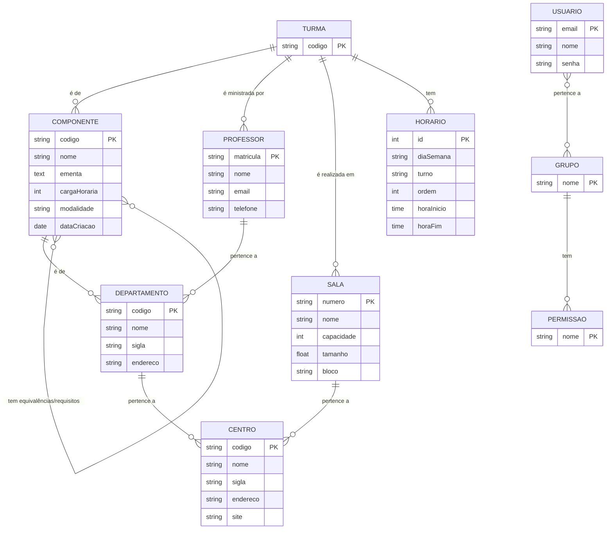

# Documento de Visão

Documento construído a partido do **Modelo BSI - Doc 001 - Documento de Visão** que pode ser encontrado no
link: https://docs.google.com/document/d/1DPBcyGHgflmz5RDsZQ2X8KVBPoEF5PdAz9BBNFyLa6A/edit?usp=sharing

## Descrição do Projeto

Título: Sistema de Gestão de Assistência Técnica
Descrição: O Sistema de Gestão de Assistência Técnica é uma aplicação web que tem como objetivo gerenciar clientes, ordens de serviço, equipamentos e visitas técnicas de forma organizada e eficiente. Ele permite cadastrar e acompanhar ordens de serviço, e gerar relatórios para facilitar o acompanhamento das atividades. O sistema oferece diferentes perfis de usuários, possa acessar as funcionalidades de acordo com suas permissões.

## Equipe e Definição de Papéis

Membro     |     Papel   |   E-mail   |
---------  | ----------- | ---------- |
Jadson    | --  | -- |
Mariana     | -- | araujodemedeirosmariana@gmail.com |

### Matriz de Competências

Membro     |     Competências   |
---------  | ----------- |
Jadson    | --  |
Mariana     | -- | 

## Perfis dos Usuários

O sistema poderá ser utilizado por diversos usuários. Temos os seguintes perfis/atores:

Perfil                                 | Descrição   |
---------                              | ----------- |
Clientes | Este usuário pode verificar suas ordens de serviço, consultar contas a receber e realizar pagamentos online de serviços concluídos.
Administrativo | Este usuário é responsável pela gestão do sistema, cadastro de informações, controle financeiro e registro de pagamentos recebidos fora do sistema.
Técnicos | Este usuário é responsável pela execução dos serviços, atualização das ordens de serviço e registro de peças utilizadas.

## Lista de Requisitos Funcionais

### Entidade Autenticar - RF01 - Autenticar
Ato dos usuários (clientes e funcionários) realizem login utilizando credenciais válidas.

Requisito                     | Descrição   | Ator |
---------                     | ----------- | ---------- |
RF01.1 - Realizar Login       | Permitir que usuários (clientes e funcionários) realizem login utilizando credenciais válidas. | Cliente, Funcionário |
RF01.2 - Realizar Logout      | Açao que permitir ao usuário encerre sua sessão com segurança. | Cliente, Funcionário |
RF01.3 - Recuperar Senha      | Açao que permitir ao usuário recupere sua senha por meio de e-mail ou SMS. | Cliente, Funcionário |

---

### Entidade Cliente - RF02 - Manter Cliente
Um cliente representa uma pessoa ou empresa que utiliza os serviços da assistência técnica. Possui informações detalhadas como nome, endereço, contato, CPF e histórico de serviços.

Requisito                     | Descrição   | Ator |
---------                     | ----------- | ---------- |
RF02.1 - Cadastrar Cliente    | Insere novo novo cliente informando: id, nome, endereço, contato, CPF. | Administrativo |
RF02.2 - Alterar Cliente      | Atualiza qualquer dado contido no cadastro do cliente, caso seja necessário. | Administrativo |
RF02.3 - Consultar Cliente   | Consulta do cliente através dos dados do mesmo. | Administrativo |
RF02.4 - Desativar Cliente   | Desativar um cliente informando o id. | Administrativo |

---

### Entidade Funcionário - RF03 - Manter Funcionário
Um funcionário representa o usuário responsável pelas operações do sistema, classificados como: Técnico e Administrativo.

Requisito                     | Descrição   | Ator           |
---------                     | ----------- | ----------     |
RF03.1 - Cadastrar Funcionário | Insere novo funcionário informando: código, nome, CPF, cargo, salario, carteira, expendiente. | Administrativo |
RF03.2 - Alterar Funcionário | Atualiza um departamento informando: código, nome, CPF, cargo, salario, carteira, expendiente. | Administrativo |
RF03.3 - Consultar Funcionário |  Consulta do funcionário através dos dados do mesmo. | Administrativo |
RF03.4 - Desativar Funcionário | Desativar um funcionário informando o id. | Administrativo |

---

### Entidade Ordem de Serviço - RF04 - Manter Ordem de Serviço
Uma ordem de serviço registra o atendimento realizado, podendo conter vários equipamentos e status de acompanhamento.

Requisito                     | Descrição   | Ator           |
---------                     | ----------- | ----------     |
RF04.1 - Abrir ordem de Serviço  | Criar de order de serviço para solicitação de reparo ou manutenção, incluir informações sobre o cliente, descrição do problema e quaisquer detalhes relevantes. | Administrador, Cliente |
RF04.2 - Editar ordem de serviço | Listagem de salas utilizando filtros nos atributos: número, nome, capacidade, tamanho, bloco e centro. | Administrador |
RF04.3 - Consultar ordem de serviço | Atualiza uma sala informando: nome, capacidade, tamanho, bloco e centro. | Administrador |
RF04.4 - Atualizar Status da OS         | Deleta uma sala informando o número. | Administrador |
RF04.5 - Encerrar ordem de serviço         | Deleta uma sala informando o número. | Administrador |
RF04.6 - Emitir Relatório         | Deleta uma sala informando o número. | Administrador |
---

### Entidade Equipamento  - RF05 - Manter Equipamento 
Um componente essencial ao realizar OS. Ele tem: código, tipo, marca, modelo, quantidade.

Requisito                     | Descrição   | Ator           |
---------                     | ----------- | ----------     |
RF05.1 - Cadastrar Equipamento   | Insere novo equipamento informando: código, tipo, marca, modelo, quantidade. | Administrador |
RF05.2 - Listar Equipamento   | Listagem dos equipamentos cadastrados. | Administrador |
RF05.3 - Consultar Equipamento | Consultar equipamento informando: código, tipo, marca, modelo. | Administrador |
RF05.4 - Desativar Equipamento   | Desativa um equipamento informando seu identificador. | Administrador |

---

### Entidade Visita Técnica - RF006 - Agendar Visitas Técnicas
Uma visita técnica representa um atendimento presencial vinculado a uma ordem de serviço.

Requisito                     | Descrição   | Ator           |
---------                     | ----------- | ----------     |
RF06 - Agendar Visitas Técnicas  | Funcionalidade que permite ao funcionário administrativo agendar visitas presenciais para resolver problemas que não podem ser resolvidos remotamente.  | Administrador |

---

### Entidade Professor - RF007 - Registrar Conta Receber 
Um professor tem: matrícula, nome, e-mail, telefone e o departamento.

Requisito                     | Descrição   | Ator           |
---------                     | ----------- | ----------     |
RF07   | Insere novo professor informando: matrícula, nome, e-mail, telefone e departamento. | Administrador |

---

### Entidade Turma - RF008 - Pagar Conta
Uma turma tem: código, professores, salas e horários. É de um componente curricular e pode ter mais de um professor, uma ou mais salas e vários horários de aulas.

Requisito                     | Descrição   | Ator                      |
---------                     | ----------- | ----------                |
RF08 - Inserir Turma        | Insere nova turma informando: código, componente curricular, professores, salas e horários. | Chefes, Coordenadores |

---

### Modelo Conceitual

Abaixo apresentamos o modelo conceitual usando o **Mermaid**.

#### Descrição das Entidades

## Lista de Requisitos Não-Funcionais

Requisito                                 | Descrição   |
---------                                 | ----------- |
RNF001 - Deve ser acessível via navegador | Deve abrir perfeitamento no Firefox e no Chrome. |
RNF002 - Consultas deve ser eficiente | O sistema deve executar as consultas em milessegundos |
RNF003 - Log e histórico de acesso e funções | Deve manter um log de todos os acessos e das funções executadas pelo usuário |

## Riscos

Tabela com o mapeamento dos riscos do projeto, as possíveis soluções e os responsáveis.

Data | Risco | Prioridade | Responsável | Status | Providência/Solução |
------ | ------ | ------ | ------ | ------ | ------ |
10/03/2018 | Não aprendizado das ferramentas utilizadas pelos componentes do grupo | Alta | Todos | Vigente | Reforçar estudos sobre as ferramentas e aulas com a integrante que conhece a ferramenta |
10/03/2018 | Ausência por qualquer motivo do cliente | Média | Gerente | Vigente | Planejar o cronograma tendo em base a agenda do cliente |
10/03/2018 | Divisão de tarefas mal sucedida | Baixa | Gerente | Vigente | Acompanhar de perto o desenvolvimento de cada membro da equipe |
10/03/2018 | Implementação de protótipo com as tecnologias | Alto | Todos | Resolvido | Encontrar tutorial com a maioria da tecnologia e implementar um caso base do sistema |

### Referências
